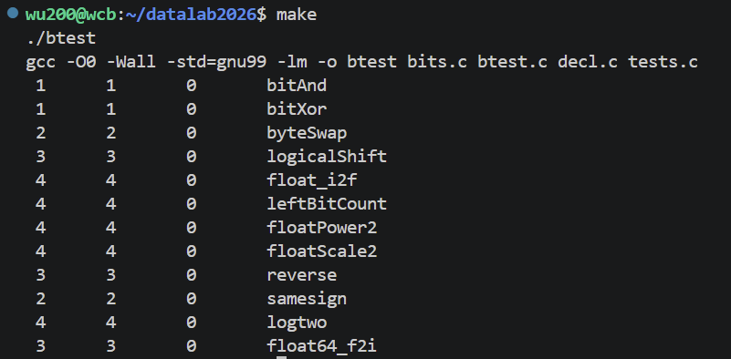

# datalab 报告

姓名：吴晨博

学号：2025201692


| 总分    | bitAnd | bitXor | samesign | logtwo | byteSwap | reverse | logicalShift | leftBitCount | float\_i2f | floatScale2 | float64\_f2i | floatPower2 |
| ----- | ------ | ------ | -------- | ------ | -------- | ------- | ------------ | ------------ | ---------- | ----------- | ------------ | ----------- |
| 37/37 | 1/1    | 1/1    | 2/2      | 4/4    | 4/4      | 3/3     | 3/3          | 4/4          | 4/4        | 4/4         | 3/3          | 4/4         |

test 截图：



## 解题报告

### 亮点

按实现难度与精细程度排序，重点讲解我自认为最出色的几个：


1. `float_i2f` —— 整数转 IEEE 754 单精度，涉及 round-to-even 舍入与进位边界，坑最多、最值得展开

2. `float64_f2i` —— 64 位双精度转 32 位 int，需在受限运算符（禁用 `==`、`^`）下完成指数 / 尾数拼接

3. `leftBitCount` —— 倍增法统计最高位连续 1

4. `logtwo` —— 二分定位最高有效位


***

### 简单位运算（bitAnd /bitXor）


* **bitAnd**：利用 De Morgan 律，`x & y = ~(~x | ~y)`，只用 `~` 和 `|` 两种符号，4 ops。

* **bitXor**：异或可拆为 "同 0 部分取反" 与 "同为 1 部分取反" 的与：`~( ~x & ~y ) & ~( x & y )`。前一项当 x、y 都为 0 时为 0，后一项当都为 1 时为 0，两者相与排除相等情形，剩下方为 1，得到异或。

### samesign

判断两个数是否同号，且 0 视为同时正负（`samesign(0,0)=1`）。

思路：


* 先取符号位 `X=x>>31`、`Y=y>>31`，`sameSign = !(X ^ Y)`，同号时为 1；

* 特判双零 `xzero && yzero`，直接返回 1；

* 非零情况下返回 `sameSign` 且两者都非零（`!xzero && !yzero`），避免 "一个 0 一个非 0" 被误判为同号。

### logtwo

求正整数 v 的以 2 为底的对数，即最高有效位位置。采用**二分倍增**：


```
res = 0
s = (v > 0xFFFF) << 4   // 若 v 有 ≥16 位有效，记下 16 并右移
res |= s; v >>= s
s = (v > 0xFF) << 3     // 再判 8 位
...
依次判 4、2、1 位，累加到 res
```

每次用一次比较 + 移位确定一位二进制对数，共 5 轮，得到最高位位置，符合 `> < >> << |` 限制。

### byteSwap

交换第 n 字节和第 m 字节：


1. 算出两字节的位移 `sn=n<<3`、`sm=m<<3`；

2. 用 `&0xFF` 分别取出第 n、m 字节 `bn`、`bm`；

3. 先用 `~(0xFF<<sn | 0xFF<<sm)` 清零原两字节位置，再按对方位移放回：`(bn<<sm) | (bm<<sn)`。

### reverse

翻转 32 位无符号整数的位序，采用**蝴蝶网络分治**：先交换相邻位，再交换相邻 2 位组、4 位组、8 位组、16 位组，最后高低 16 位互换。每轮用掩码 `0x55555555`、`0x33333333` 等分离奇偶 / 高低半，再左右移位后或合并，5 步完成。

### logicalShift

实现逻辑右移。算术右移 `x>>n` 会把最高位符号扩展填充高位，需要清掉这些扩展位：

`mask = ~(((1<<31)>>n)<<1)`，构造一个低 32-n 位为 1、高位为 0 的掩码，与算术右移结果相与即得到逻辑右移结果。

### leftBitCount

统计最高位起连续 1 的个数。用**倍增判断 + 左移归并**：


* 检查高 16 位是否全 1（`x & 0xFFFF<<16` 是否等于 `0xFFFF<<16`），是则计数 +16 并将 x 左移 16 位；

* 依次对高 8、4、2、1 位做同样判断，计数逐级累加；

* 最后特判全 1（`x == ~0`）补上第 32 个 1。

每轮用 "与上掩码再异或掩码再取反" 判断该段是否全 1，利用 `!` 把布尔结果转成 0/1 参与计数。

### float\_i2f（重点）

整数转单精度浮点。IEEE 754 单精度：1 位符号 + 8 位指数 + 23 位尾数，规格化数有**隐含前导 1**（不存储）。

思路：


1. **特判**：`x==0` 返回 0；`x==0x80000000`（int 最小值，取负会溢出）直接返回其位模式 `0xCF000000`。

2. 取符号 `s`，负数取绝对值 `absX`。

3. `while` 循环找到最高有效位位置 `bitPos`，`absX = 1.xxx × 2^bitPos`。

4. **指数**：`e = bitPos + 127`（加偏置）。隐含的 1 不存储。

5. **尾数**：

* `bitPos > 23`：整数有效位超过 24 位，需截断。右移 `bitPos-23` 得到高 23 位尾数，被丢弃的低位 `roundBits` 用于**round-to-even 舍入**：大于半位则加 1；恰好等于半位且当前尾数末位为 1 才加 1（保证舍入后末位为偶数）；

* `bitPos <= 23`：有效位不足，直接左移 `23-bitPos` 补 0。

1. **进位处理**（关键坑）：尾数加 1 后若溢出到第 24 位，指数 +1、尾数清零。判断溢出不能用 `m >> 23`—— 因为 m 本身包含隐含的前导 1，其第 23 位恒为 1，会误判；必须用 `m & 0x1000000` 检测第 24 位，仅当舍入加法真正产生进位时才触发。

2. 组合返回 `s | (e<<23) | (m & 0x7FFFFF)`。

### floatScale2

浮点数乘 2。按指数段分类：


* `e == 0`（非规格化）：尾数左移 1 位即乘 2，符号保持不变；全 0 原样返回；

* `e == 0xFF<<23`（Inf/NaN）：原样返回；

* 规格化：指数 `e + (1<<23)` 即加 1；若指数已达 `0xFE<<23`（乘 2 后溢出为 Inf），返回 `Inf`。

### float64\_f2i（重点）

64 位双精度转 32 位 int，向零舍入。双精度：1 符号 + 11 指数 + 52 尾数，参数分高 32 位 `uf2`（含符号、指数、尾数高位）和低 32 位 `uf1`（尾数低位）。

思路：


1. 解析符号 `s`、指数 `e`（`uf2>>20 & 0x7FF`）；

2. **边界**：`e==0` 返回 0；`e==0x7FF`（Inf/NaN）返回 `0x80000000`；指数 `exp=e-1023`，`exp<0` 返回 0，`exp>=31` 溢出返回 `0x80000000`；

3. 拼接整数：隐含前导 1 加尾数高位 `h`、低位 `l`，根据 `k=52-exp` 决定右移位数（>32 时只需高段，否则拼 `h<<(32-k) | l>>k`）得到整数 `xx`；

4. 按符号返回 `xx` 或 `-xx`。

**受限运算符处理**：题目禁用 `==` 与 `^`。判断 `e==0x7FF` 改用嵌套比较 `if(e>=0x7FFU){ if(e<=0x7FFU){...} }`，用 `>=`/`<=` 组合等价判定相等，避免使用非法运算符。

### floatPower2

求 2^x 的单精度位模式。单精度指数范围 `[-126,127]`，尾数 23 位。


* `x>=128`：溢出返回 `+INF`（`0x7F800000`）；

* `-126<=x<128`：规格化数，指数位 `(x+127)<<23`；

* `x<-149`：下溢返回 0；

* 其余为**非规格化**：`1U << (x+149)`，用移位直接构造最小尾数。


***

## 反馈 / 收获 / 感悟 / 总结

本次实验对位运算和 IEEE 754 浮点表示有了很深的实操理解。最深的体会：浮点题（尤其 `float_i2f`）的难点不在 "算出正确结果"，而在**在受限运算符与 op 数量约束下处理好边界和舍入**，例如隐含前导 1 带来的进位误判（`m>>23` 恒为 1 的坑），以及用 `m & 0x1000000` 判断第 24 位。另一个教训是 `==`、`^`、`&&` 等运算符在部分题目中被禁用，很多 "显然" 的写法会被判非法，需要换一种等价位运算表达。整体难度适中偏难，收益很大。

## 参考的重要资料


* Randal E. Bryant, David R. O'Hallaron. *深入理解计算机系统（CS:APP）* 第 2 章（信息的表示与处理）—— 位运算与 IEEE 754 浮点表示

* Datalab 实验说明（README.md 及 bits.c 各题目注释）—— 运算符与 op 数量约束

* IEEE 754 单 / 双精度浮点格式标准（round-to-even 舍入规则）